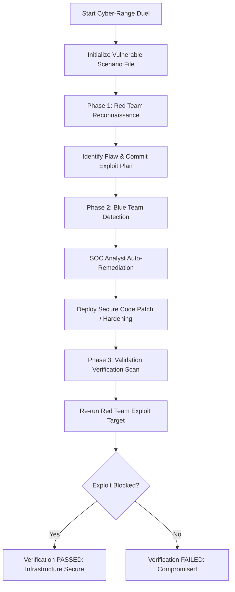

# Vyber: Autonomous Self-Healing Cyber-Range

**Vyber** is a fully autonomous, self-healing cyber-range prototype built for the Hugging Face **Build Small Hackathon**. It showcases how small, highly-optimized language models ($\le$ 1.5B parameters) can automate complex offensive and defensive cybersecurity workflows in real-time, isolated container sandboxes.

Vyber stacks two merit badges for the Build Small Hackathon:
* **Well-Tuned Badge**: Run custom instruction fine-tuning on a curated cybersecurity dataset, compile the result directly to GGUF, and deploy it.
* **Llama Champion Badge**: Run local inference using the highly-optimized `llama.cpp` runtime compiled with CUDA GPU-offloading inside serverless Modal containers.

---

## Architecture & Workflow

Vyber operates as a closed-loop autonomous simulation (a "duel") inside isolated sandboxes. 



### 1. Offensive Agent (Red Team)
Simulates an elite attacker performing automated reconnaissance and exploitation. It scans configurations, executes targeted shell queries inside the sandbox container, identifies the flaw, and outputs a structured JSON exploit strategy.

### 2. Defensive Agent (Blue Team)
Acts as an autonomous, self-healing Security Operations Center (SOC) responder. It intercepts the Red Team's exploit strategy, retrieves the vulnerable configuration file, writes an updated and secure version, issues system hardening policies (like changing Unix permissions via `chmod` or reloading certificate authorities), and deploys the fix.

### 3. Automated Verification Loop
Forces the Red Team agent to execute its recon and exploit tools a second time against the modified files. If the exploit is blocked, the defense patch is validated as successfully hardened, yielding a 100% healed system.

---

## Hackathon Badge Integration

### 1. Well-Tuned Badge (Fine-Tuning & GGUF)
* **Dataset**: Fine-tuned on the `Trendyol/Trendyol-Cybersecurity-Instruction-Tuning-Dataset` using `SFTTrainer` with parameter-efficient LoRA adapters (`PEFT`).
* **Base Model**: `Qwen/Qwen2.5-1.5B-Instruct` (FP16 base weights).
* **Merging**: Adapters merged directly into base weights to prevent downstream degradation.
* **Quantization & Format**: Converted to GGUF using `llama.cpp`'s `convert_hf_to_gguf.py` utility.
* **Publishing**: Automatically published to the Hugging Face Hub under: [vxkyyy/vyber-security-1.5b-gguf](https://huggingface.co/vxkyyy/vyber-security-1.5b-gguf).

### 2. Llama Champion Badge (Local llama.cpp + CUDA)
* **Runtime**: Runs local GGUF inference directly inside serverless container environments via `llama-cpp-python` with CUDA acceleration.
* **Compilation**: Compiled from source on A10G GPUs during image builder phase by symlinking CUDA stubs:
  ```bash
  ln -sf /usr/local/cuda/lib64/stubs/libcuda.so /usr/local/cuda/lib64/stubs/libcuda.so.1
  LD_LIBRARY_PATH=/usr/local/cuda/lib64/stubs:$LD_LIBRARY_PATH CMAKE_ARGS="-DGGML_CUDA=on" pip install llama-cpp-python
  ```
* **GPU Offloading**: Configured with `n_gpu_layers=-1` to fully offload the network layers to the GPU, minimizing inference latency down to milliseconds.

---

## Project Repository Structure

* **[app.py](app.py)**: Gradio web dashboard featuring a dark mode developer console that streams logs from both terminals side-by-side.
* **[backend.py](backend.py)**: Serverless backend definition for Modal. Orchestrates the file sandbox creation, validation check rules, simulation execution pipelines, and hosts the GPU-accelerated `ModelServer` class.
* **[train_and_convert.py](train_and_convert.py)**: Fully automated serverless training pipeline script to fine-tune the 1.5B model, merge layers, build the GGUF, and upload the artifact to Hugging Face.
* **[requirements.txt](requirements.txt)**: Requirements for the local web dashboard.

---

## Target Scenarios

| Scenario | Vulnerability Flaw | Defensive Mitigation Patch |
| :--- | :--- | :--- |
| **1. Secret Leak** | Plain-text database credentials and admin API keys in `app_config.json`. | Extract secrets to environment variables, rewrite config, restrict system permissions (`chmod 600`). |
| **2. Exposed DB Port** | PostgreSQL database globally bound to interface `0.0.0.0` with auth disabled. | Bind binding interface to loopback localhost (`127.0.0.1`) and enforce strong authentication rules. |
| **3. MITM Pipeline** | Unencrypted transit of billing JSON payloads over HTTP network endpoints. | Enforce HTTPS protocol upgrade, enable SSL verification, and restrict accepted ciphers to `AES-256-GCM`. |

---

## Quick Start

### 1. Prerequisites & Credentials
Export your Hugging Face write token and username to authenticate training runs and upload outputs:
```bash
export HF_TOKEN="your_huggingface_write_token"
export HF_USERNAME="your_huggingface_username"
```

### 2. Run the Automated Fine-Tuning Pipeline
To execute the serverless model training, merging, GGUF conversion, and automatic HF upload:
```bash
modal run train_and_convert.py --repo-name vyber-security-1.5b-gguf
```

### 3. Deploy the Serverless Backend
To build the CUDA-enabled container image, compile `llama-cpp-python`, and deploy the serverless endpoints:
```bash
modal deploy backend.py
```

### 4. Run the Web Dashboard Locally
Install requirements and launch the Gradio user interface:
```bash
pip install -r requirements.txt
python app.py
```
Open `http://localhost:7860` in your browser to run the simulations.

---

## Customizing the Target Server Backend

Vyber is designed to be highly modular. By default, the offensive and defensive agents run inside a local container sandbox (`/tmp/sandbox`). However, you can easily adapt the system to target real remote servers:

### 1. Pointing to your Custom Modal Backend
If you deploy the backend under a different Modal application name:
1. In `backend.py`, update the application initialization:
   ```python
   app = modal.App("your-custom-app-name")
   ```
2. In `app.py`, update the Gradio remote function lookup:
   ```python
   f = modal.Function.from_name("your-custom-app-name", "run_duel_stream")
   ```

### 2. Targeting Real Remote Servers
Instead of running commands locally inside the sandbox folder, you can direct the agents to execute actions on an external host:
1. **Pass Credentials Securely**: Store SSH keys, host IPs, and ports in your Modal secrets or pass them through `openai_api_key` environment mappings.
2. **Modify the Command Runner**: Update the `vyber_run` helper function inside `backend.py` to route shell commands through a secure channel (e.g., executing commands via `paramiko` or an SSH client connection to the remote target host) instead of running `subprocess.run(...)` locally.
3. **Update Agent Prompts**: Modify the agent's target description prompts in the execution loop to point the LLM to the absolute file paths on your target server (e.g., `/etc/nginx/nginx.conf` or database config folders).

---

## License
Distributed under the MIT License. See `LICENSE` for more information.
