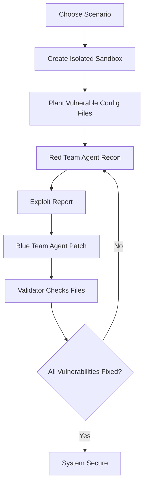

# Vyber

**Vyber** is a two-agent cybersecurity range for the Hugging Face **Build Small Hackathon**. It uses a fine-tuned small model as a cyber expert that can inspect vulnerable server configuration files, identify security issues, generate patch plans, apply fixes in an isolated sandbox, and verify whether the system has been healed.

The core idea is simple:

1. The **Red Team Agent** finds the vulnerability.
2. The **Blue Team Agent** patches the vulnerability.
3. The **Red Team Agent re-runs the same exploit** to prove whether the patch actually blocked the attack.

Vyber is designed as a safe, defensive demo. The included app runs against controlled sandbox files, not real third-party infrastructure.

## Model

Vyber is powered by the published GGUF model:

**[`vxkyyy/vyber-security-7b-gguf`](https://huggingface.co/vxkyyy/vyber-security-7b-gguf)**

Model details:

- Base model: `Qwen/Qwen2.5-7B-Instruct`
- Fine-tuning method: PEFT / LoRA
- Format: GGUF for `llama.cpp`
- Runtime: `llama-cpp-python` inside Modal GPU containers
- Primary role: cybersecurity instruction following, configuration auditing, vulnerability reasoning, and defensive patch generation
- License: Apache 2.0

The model is loaded in [backend.py](backend.py) through `llama.cpp` with GPU offloading. If the custom 7B model is unavailable, the backend attempts smaller or public fallback GGUF models.

## What Vyber Does

Vyber simulates an autonomous security response loop:



The Gradio UI streams both agents into one continuous operation terminal:

- **Phase 01 / Red Team Discovery**: reconnaissance, target files, exploit report
- **Phase 02 / Blue Team Remediation**: detection, remediation actions, patch output
- **Status banner**: current phase and final verdict

The interface is intentionally terminal-first: calm typography, compact status, no decorative chat bubbles, and a chronological trace that reads like a real security operation.

## Built-In Cyber-Range Scenarios

| Scenario | Vulnerabilities Planted | Defensive Fix Expected |
| --- | --- | --- |
| Secret Leak | Hardcoded database password, API key, cloud keys, world-readable deploy script | Parameterize secrets, remove plaintext keys, restrict file permissions |
| Exposed Database | Database bound to `0.0.0.0`, authentication disabled, weak TLS, open firewall | Bind to localhost, require auth, enforce TLS 1.2/1.3, restrict inbound ports |
| MITM Pipeline | HTTP endpoint, SSL disabled, plaintext card data in logs, public admin API | Enforce HTTPS, verify certificates, require encryption, scrub PII, enable auth and rate limits |
| DVWA-style SQL Injection | String-built login SQL, weak session cookies, leaked reset tokens | Parameterize queries, hash passwords, enable CSRF and secure cookies, scrub auth logs |
| Juice Shop-style Broken Auth | Unsigned JWTs, permissive CORS, public admin API, payment debug leaks | Verify JWTs, use env-backed secrets, scope CORS, rate-limit APIs, remove payment telemetry |
| WebGoat-style Deserialization | Unsafe pickle loading, unrestricted uploads, root worker permissions | Replace unsafe parser, validate schema, restrict upload policy, enforce least privilege |

Each scenario contains three separate vulnerabilities. Vyber does not pass the run until all vulnerabilities in that scenario are fixed.

## Repository Structure

Public GitHub repository for the Codex prize track:

**[`Vickyrrrrrr/vyber-cyber`](https://github.com/Vickyrrrrrr/vyber-cyber)**

```text
.
├── app.py              # Gradio dashboard and Modal function client
├── backend.py          # Modal backend, model server, agent loop, Red re-attack checks
├── requirements.txt    # Local Gradio app dependencies
└── README.md           # Project documentation and Hugging Face Space card
```

The model training and conversion pipeline has already been completed. The trained model artifact is published on Hugging Face, so this live Space only contains the app and backend needed to run the cyber-range.

## How The Backend Works

### 1. Scenario Initialization

`CyberRangeScenarios.init_scenario(...)` creates vulnerable files under `/tmp/sandbox`, such as:

- `app_config.json`
- `server.env`
- `deploy.sh`
- `db_settings.yaml`
- `nginx.conf`
- `firewall_rules.json`
- `pipeline_config.json`
- `traffic_stream.log`
- `api_gateway.json`
- `login_handler.py`
- `auth_routes.js`
- `profile_importer.py`
- lab-specific policy and audit files

### 2. Red Team Agent

The Red Team Agent receives a list of unpatched vulnerabilities and is asked to inspect the sandbox. It produces an exploit report that summarizes the current risk.

Example output shape:

```text
EXPLOIT_REPORT:
S1-V1: app_config.json contains plaintext database and API secrets.
S1-V2: server.env contains cloud and payment provider keys.
S1-V3: deploy.sh is world-readable and includes a database password.
```

### 3. Blue Team Agent

The Blue Team Agent receives the exploit report and rewrites vulnerable files with secure replacements. It can also issue hardening commands such as permission changes.

Example remediation actions:

- Replace hardcoded secrets with environment-variable references
- Change database host from `0.0.0.0` to `127.0.0.1`
- Enable authentication
- Remove weak SSL protocols
- Restrict public firewall rules
- Scrub sensitive data from logs
- Disable public admin endpoints

### 4. Red Re-Attack Loop

After Blue patches the files, Red re-runs the same exploit recipe that discovered the weakness. A vulnerability is considered fixed only when that exploit attempt is blocked.

## Running Locally

Install dependencies:

```bash
pip install -r requirements.txt
```

Launch the Gradio app:

```bash
python app.py
```

Open:

```text
http://localhost:7860
```

The app first tries to call the deployed Modal backend:

```python
modal.Function.from_name("cyber-defense-range", "run_duel_stream")
```

If that lookup fails, it attempts local Modal execution.

## Deploying The Backend

Deploy the Modal backend:

```bash
modal deploy backend.py
```

The backend image installs:

- CUDA base image
- `llama-cpp-python` with CUDA support
- `nmap`, `curl`, `git`, build tools
- Python packages for Modal, Gradio, YAML, OpenAI fallback, and Hugging Face Hub

The model server downloads the GGUF model from Hugging Face and runs it through `llama.cpp`.

## Using Vyber On Your Own Server

Vyber can be adapted for defensive audits of servers you own or are explicitly authorized to test. The default version intentionally runs only inside `/tmp/sandbox` so the hackathon demo is safe and reproducible.

To connect it to a real server, use this pattern:

### 1. Create a Target Profile

Define the server details you want Vyber to inspect:

```text
TARGET_NAME=production-web-01
TARGET_HOST=your.server.ip
TARGET_PORT=22
TARGET_USER=audit-user
```

Store credentials in Modal secrets, not in source code.

### 2. Replace The Command Runner

The current helper is:

```python
def vyber_run(instruction: str, workspace_dir: str) -> str:
```

For a real server, replace the local `subprocess.run(...)` path with a secure SSH runner using `paramiko` or the system `ssh` client.

Recommended first commands for audit mode:

```text
cat /etc/nginx/nginx.conf
cat /etc/postgresql/*/main/postgresql.conf
cat /etc/postgresql/*/main/pg_hba.conf
ls -la /var/www
find /var/www -maxdepth 3 -name "*.env" -o -name "*.json" -o -name "*.yaml"
```

Start with read-only commands. Let Vyber generate a patch plan before enabling automatic writes.

### 3. Add Server-Specific Validators

For each server type, add validation rules similar to the existing scenario checks:

- Web server: TLS version, ciphers, exposed admin routes
- Database: bind address, auth mode, open ports
- App config: hardcoded secrets, debug flags, permissive CORS
- File permissions: world-readable secret files or deploy scripts
- Logs: exposed tokens, payment data, credentials, or PII

The re-attack loop is what makes Vyber more than a chatbot. Red must prove the original exploit no longer works after Blue patches the target.

### 4. Run In Review Mode First

For real infrastructure, the safest flow is:

1. Read server files.
2. Produce vulnerability report.
3. Generate patch diff.
4. Human reviews patch.
5. Apply patch.
6. Re-run the original exploit attempt.

Only enable fully automatic remediation after you trust the target profile and re-attack checks.

## Safety Boundaries

Use Vyber only on systems you own or have explicit permission to assess. The project is intended for:

- Defensive security auditing
- Developer education
- Cyber-range simulation
- Secure configuration repair
- Patch validation workflows

Do not use Vyber to scan, exploit, or modify third-party systems without authorization.

## Hackathon Fit

Vyber is built for the Build Small Hackathon constraints:

- **Small model**: custom 7B cybersecurity model, under the 32B parameter limit
- **Gradio app**: hosted as a Hugging Face Space
- **Show, don't tell**: visual two-agent terminal trace

Bonus badge alignment:

- **Well-Tuned**: uses a fine-tuned model published on Hugging Face
- **Llama Champion**: runs GGUF inference through `llama.cpp`
- **Off-Brand**: custom Gradio styling instead of default UI
- **Sharing is Caring**: agent traces can be exported or shared for learning
- **Field Notes**: project writeup can explain the design, training, and validation loop

## Environment Variables

Optional:

```bash
export OPENAI_API_KEY="..."
```

The OpenAI key is only used as a fallback if local GGUF model loading fails.

For real-server adaptation, store SSH credentials and target config as Modal secrets rather than local `.env` files.

## License

Distributed under the MIT License.
