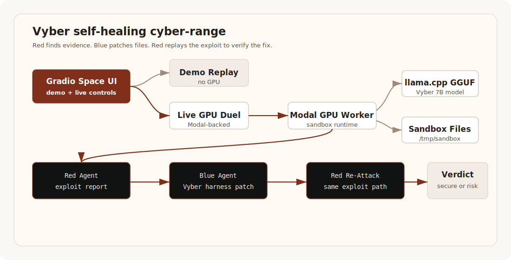

# Vyber

**Vyber** is a self-healing cyber-range for the [Hugging Face Build Small Hackathon](https://huggingface.co/build-small-hackathon). It runs a two-agent security loop where a Red Agent finds vulnerable server patterns, a Blue Agent patches the files inside an isolated sandbox, and Red replays the same exploit path to verify whether the fix actually worked.

Vyber is built around a fine-tuned 7B cybersecurity model published on Hugging Face:

- **Model:** [`vxkyyy/vyber-security-7b-gguf`](https://huggingface.co/vxkyyy/vyber-security-7b-gguf)
- **App:** [`build-small-hackathon/vyber-cyber`](https://huggingface.co/spaces/build-small-hackathon/vyber-cyber)
- **Code:** [`Vickyrrrrrr/vyber-cyber`](https://github.com/Vickyrrrrrr/vyber-cyber)

The goal is simple: make defensive security feel like a live repair operation, not a static scanner report.

## Why Vyber Exists

Small teams often know they should fix security issues, but the gap between "finding a vulnerability" and "shipping a safe patch" is painful:

- scanners produce long reports without repair context
- developers need exact file-level fixes, not generic advice
- security teams need proof that the original exploit no longer works
- students need safe, repeatable environments to learn real defensive patterns

Vyber turns that workflow into an agentic loop:

1. **Red finds evidence** by reading vulnerable files in a sandbox.
2. **Red writes an exploit report** with affected files, CWE class, evidence, attack path, and impact.
3. **Blue patches the code/config** using a tool harness with read, edit, and shell access scoped to `/tmp/sandbox`.
4. **Red re-attacks** using the original exploit recipe.
5. **Vyber passes only when the exploit is blocked.**

That last step is the product: not "the AI says it fixed it", but "the same attack no longer works."

## What Works Today

Vyber currently has two execution modes.

### Public Demo Replay

The demo replay is a scripted no-GPU trace for public visitors. It exists so the Hugging Face Space can stay usable even if many people open it at once.

- no GPU credits used
- instant startup
- shows the intended Red -> Blue -> Red verification experience
- safe for public traffic

### Live GPU Duel

The live mode runs the actual Modal-backed cyber-range loop.

- creates vulnerable lab files under `/tmp/sandbox`
- loads the fine-tuned GGUF model through `llama.cpp`
- asks the Red Agent to inspect files and produce an exploit report
- gives the Blue Agent a Vyber tool harness for file reads, edits, and shell commands
- re-runs Red verification checks after the patch attempt

The lab vulnerabilities are intentionally seeded by the cyber-range. The fixes are applied to real sandbox files during the live run.

## Current Safety Boundary

Vyber does **not** scan random public servers. It is a defensive cyber-range for controlled targets.

Current targets:

- generated vulnerable config files
- OWASP-inspired lab patterns
- isolated Modal `/tmp/sandbox` workspace

Future targets:

- user-owned GitHub repositories
- user-owned Docker Compose apps
- intentionally vulnerable OWASP lab containers
- authorized SSH targets in review-first mode

Use Vyber only on systems you own or have explicit permission to test.

## Cyber-Range Lab Packs

Each lab pack plants three vulnerable files and three independent exploit paths.

| Lab | Theme | Vulnerabilities | Example files |
| --- | --- | --- | --- |
| Scenario 1 | Secret leak | hardcoded API keys, database passwords, world-readable deploy script | `app_config.json`, `server.env`, `deploy.sh` |
| Scenario 2 | Exposed database | public bind address, auth disabled, weak TLS, open firewall | `db_settings.yaml`, `nginx.conf`, `firewall_rules.json` |
| Scenario 3 | MITM pipeline | HTTP billing stream, SSL disabled, card data in logs, public admin API | `pipeline_config.json`, `traffic_stream.log`, `api_gateway.json` |
| Lab Pack 4 | DVWA-style auth | SQL injection, weak cookies, missing CSRF, leaked reset tokens | `login_handler.py`, `session_config.json`, `access_audit.log` |
| Lab Pack 5 | Juice Shop-style API security | broken JWT verification, permissive CORS, no rate limit, debug payment leaks | `auth_routes.js`, `api_policy.json`, `payment_debug.log` |
| Lab Pack 6 | WebGoat-style backend risk | unsafe deserialization, unrestricted uploads, root worker permissions | `profile_importer.py`, `upload_policy.yaml`, `worker_permissions.json` |

## Architecture



The README uses a static SVG because the Hugging Face file viewer does not reliably render Mermaid diagrams.

## Repository Structure

```text
.
|-- app.py              # Gradio UI, demo replay, Modal client
|-- backend.py          # Modal backend, model server, lab generator, agent loop
|-- requirements.txt    # Space/local Python dependencies
`-- README.md           # Space card and project documentation
```

## Model And Runtime

- **Model:** `vxkyyy/vyber-security-7b-gguf`
- **Base family:** Qwen2.5 7B Instruct
- **Format:** GGUF
- **Runtime:** `llama.cpp` through `llama-cpp-python`
- **Backend:** Modal GPU worker
- **Frontend:** Gradio on Hugging Face Spaces
- **Agent harness:** Vyber CLI wrapper for scoped read/edit/bash access inside the sandbox

The model is small enough for the hackathon limit and specialized enough to act as a cybersecurity repair assistant.

## Who Can Use Vyber

Vyber is useful for:

- developers learning how vulnerabilities become patches
- security students practicing Red/Blue workflows
- small teams that want understandable remediation traces
- hackathon judges evaluating a live agentic security system
- future platform users who want repo-level or container-level security repair

It is not intended for unauthorized scanning or exploitation.

## Local Run

Install dependencies:

```bash
pip install -r requirements.txt
```

Run the Gradio app:

```bash
python app.py
```

Open:

```text
http://localhost:7860
```

If `gradio` is missing locally, install the requirements inside the active virtual environment:

```bash
python -m pip install -r requirements.txt
```

## Deploy Backend

Deploy the Modal backend:

```bash
modal deploy backend.py
```

The frontend calls:

```python
modal.Function.from_name("cyber-defense-range", "run_duel_stream")
```

The first live run can take several minutes because Modal may need to warm hardware, build or load Python wheels, and download GGUF model weights.

## Hackathon Alignment

Vyber is designed for the Hugging Face Build Small Hackathon constraints, bonus quests, and sponsor categories.

| Requirement or award signal | Vyber alignment |
| --- | --- |
| Small models only | Uses a 7B model, below the 32B limit |
| Built on Gradio | The UI is a Gradio Space |
| Show, don't tell | The app streams a live operation terminal instead of only showing static text |
| Well-Tuned bonus | Uses a fine-tuned model published on Hugging Face |
| Llama Champion bonus | Runs a GGUF model through `llama.cpp` |
| Off-Brand bonus | Custom styled Gradio interface, not default blocks styling |
| Sharing is Caring bonus | Red/Blue traces can be exported as sanitized learning artifacts |
| Best Agent special award | Red and Blue agents coordinate through tool use and verification |
| Best Demo special award | The app is built around a visible end-to-end demo trace |
| Modal Awards | Live mode runs through Modal GPU infrastructure |
| OpenAI Track / Codex | Project development uses OpenAI Codex, with commits and repo history showing implementation work |
| Field Notes bonus | A project writeup can explain model training, agent design, safety boundaries, and lessons learned |

Not currently claimed:

- **Off the Grid:** live mode uses Modal and may use fallback APIs.
- **Tiny Titan:** Vyber uses a 7B model, not a <=4B model.
- **NVIDIA Nemotron Quest:** Vyber does not currently use a Nemotron model.
- **OpenBMB Awards:** Vyber does not currently use an OpenBMB model.

## Sponsor-Fit Notes

Vyber naturally demonstrates several sponsor technologies:

- **Hugging Face:** Space hosting, published model artifact, and public project page.
- **Gradio:** custom interactive UI and streaming operation terminal.
- **Modal:** serverless GPU backend for live model inference and sandbox execution.
- **OpenAI Codex:** repo changes, implementation support, debugging, and documentation workflow.
- **llama.cpp ecosystem:** GGUF inference path for the fine-tuned cybersecurity model.

This makes the project a strong fit for agentic app judging, Modal-powered app judging, custom Gradio UI judging, and fine-tuned model judging.

## Submission Checklist

Before final submission:

- Space link: `https://huggingface.co/spaces/build-small-hackathon/vyber-cyber`
- GitHub repo link: `https://github.com/Vickyrrrrrr/vyber-cyber`
- Model link: `https://huggingface.co/vxkyyy/vyber-security-7b-gguf`
- short demo video showing demo replay and one live GPU duel
- social post explaining the Red -> Blue -> Red verification loop
- optional field-notes post covering model training, Modal deployment, `llama.cpp`, and the safety boundary
- optional sanitized trace artifact for the Sharing is Caring bonus

## Future Upgrades

### 1. OWASP Lab Container Mode

Run real vulnerable apps in controlled containers:

- OWASP Juice Shop
- OWASP WebGoat
- DVWA
- Vulhub-style Docker labs

Flow:

```text
start vulnerable container
Red probes app and reads mounted source/config
Blue patches mounted files
restart container
Red replays exploit
show pass/fail trace
```

### 2. GitHub Repo Repair Mode

Let users connect a repository they own:

```text
clone repo
run security scan
create patch branch
show diff
open pull request after approval
```

This is safer than editing production directly and fits real developer workflows.

### 3. Authorized Server Review Mode

Add SSH-based read-only scans for user-owned servers:

```text
connect with scoped audit key
read config/log files
produce vulnerability report
generate patch plan
require human approval
apply patch
re-test
```

Automatic writes should stay disabled until the user explicitly enables them.

### 4. Trace Export

Publish red/blue traces as shareable artifacts:

- exploit report
- patch diff
- re-attack verdict
- timeline JSON
- sanitized terminal transcript

This supports the hackathon's open-trace and field-notes spirit.

### 5. Stronger Validators

Current validation checks the seeded exploit patterns. Future versions can add:

- unit tests generated from exploit reports
- Semgrep or CodeQL scans
- container-level health checks
- HTTP re-attack scripts
- config policy checks with OPA/Rego

### 6. Budget-Aware Public Queue

For public Spaces traffic:

- demo replay for everyone
- one live GPU duel at a time
- queue protection
- per-session cooldown
- clear "GPU busy" state

This keeps the Space usable even if many visitors arrive during judging.

## Security And Ethics

Vyber is a defensive project. The live system operates inside a controlled sandbox and should only be extended to systems where the user has authorization.

Do not use Vyber to scan, exploit, or modify third-party systems without permission.

## License

MIT
